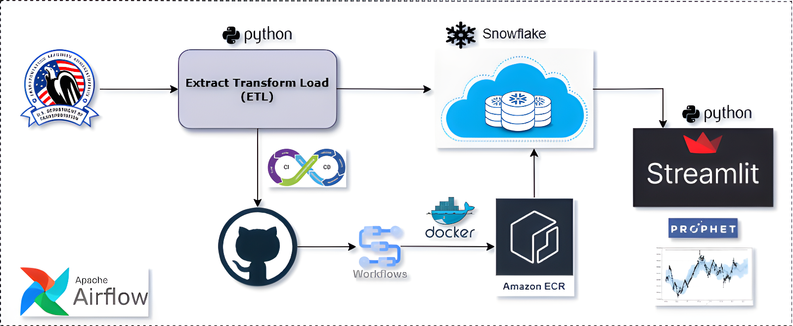

# ETL Pipeline on TSA Passenger Volumes.

## Table of Contents

- [Overview](#overview)
- [Data Source](#data-source)
- [Tech Stack & Infrastructure](#tech-stack--infrastructure)
- [Project Architecture](#project-architecture)
- [Manual Steps to Run the Application](#manual-steps-to-run-the-application)

## Overview

Developed a custom ETL pipeline using Python and Snowflake to automate the extraction and processing of passenger volume data from the TSA website. The solution scrapes raw data, thoroughly processes and cleans it, and then securely loads it into a scalable Snowflake data warehouse. Once the data gets organized, an interactive Streamlit dashboard gets deployed to visualize historical trends and key performance metrics, enabling real-time monitoring of passenger traffic and the identification of actionable insights. Furthermore, by integrating Facebook's Prophet model, the system leverages historical data to generate accurate time-series forecasts. This predictive capability helps anticipate future passenger volumes, facilitating better planning and decision-making for transportation and security operations.

The backend architecture gets further strengthened by containerizing the ETL application with Docker. It is stored in the AWS Elastic Container Registry and managed through a dedicated CI/CD pipeline. Finally, Apache Airflow orchestrates the daily execution of the dockerized ETL process to continuously update the Snowflake data warehouse, with the refreshed data seamlessly reflected in the Streamlit dashboard.

## Data Source

[TSA Checkpoint Travel Numbers](https://www.tsa.gov/travel/passenger-volumes)

## Tech Stack & Infrastructure

1. Python
2. Snowflake
3. Streamlit
4. Prophet
5. Docker
6. GitHub Actions
7. Apache Airflow
8. Amazon Elastic Container Registry
9. Doppler

## Project Architecture



## Manual Steps to Run the Application

#### Step 1: Create a [Snowflake](https://www.snowflake.com/) account.

#### Step 2: Configure [Doppler](https://www.doppler.com/) to store and manage credentials securely.

To generate a `DOPPLER_SERVICE_TOKEN`, navigate to the **Access** tab within your Doppler project's configuration and create a new Service Token.

```bash
ACCOUNT=qyieouq-yu73123
AWS_ECR_LOGIN_URI=557690579669.dkr.ecr.ap-south-1.amazonaws.com
AWS_REGION=ap-south-1
DATABASE=TSA
ECR_REPOSITORY_NAME=tsa
PASSWORD=<SNOWFLAKE-PASSWORD>
ROLE=ACCOUNTADMIN
SCHEMA=PUBLIC
TABLE=tsa_passenger_volumes
USER=<SNOWFLAKE-USERNAME>
WAREHOUSE=COMPUTE_WH
```

#### Step 3: Run the ETL Pipeline Locally.

Ensure all necessary dependencies and configurations are in place before executing the ETL pipeline locally.

```bash
# Install Dependencies.
python -m pip install --upgrade pip
pip install .

# Execute the Pipeline.
run_travel_numbers

# With Arguments.
run_travel_numbers --environment uat --start_year 2019
```

#### Step 4: Run the Streamlit Dashboard Locally.

```bash
# Launch the Dashboard.
streamlit src/tsa_checkpoint/webapp.py
```

#### Step 5: Containerize the Application using Docker.

```bash
# Build the Docker Image.
docker build -t tsa:latest .
```

#### Step 6: Run the Docker Container Locally.

```bash
# Run the Container.
docker run -it --rm -e DOPPLER_SERVICE_TOKEN=<DOPPLER-SERVICE-TOKEN> tsa:latest
```

#### Step 7: Create an AWS ECR Repository to store the Docker Image.

Use the AWS Management Console or AWS CLI to create an ECR repository. This repository will serve as the centralized storage for your Docker image.

#### Step 8: Orchestrate the ETL Workflow using Apache Airflow.

**Create a `.env` File:** Place it in the same directory as `docker-compose.yaml` with these entries:

```bash
AIRFLOW_UID=50000
AWS_ACCESS_KEY_ID=XXXXXXXXXXXXXXXXXXXX
AWS_SECRET_ACCESS_KEY=XXXXXXXXXXXXXXXXXXXXXXXXXXXXXXXXXXXXXXXX
DOPPLER_SERVICE_TOKEN=XX.XX.XXX.XXXXXXXXXXXXXXXXXXXXXXXXXXXXXXXXXXXXXXXXXXXXXX
```

```bash
# Initialize the Airflow Database.
docker compose up airflow-init

# Clean up the environment.
docker compose down --volumes --remove-orphans

# Start Airflow.
docker compose up
```

## Authors

- [Aritra Ganguly](https://in.linkedin.com/in/gangulyaritra)

## License & Copyright

[MIT License](LICENSE)
